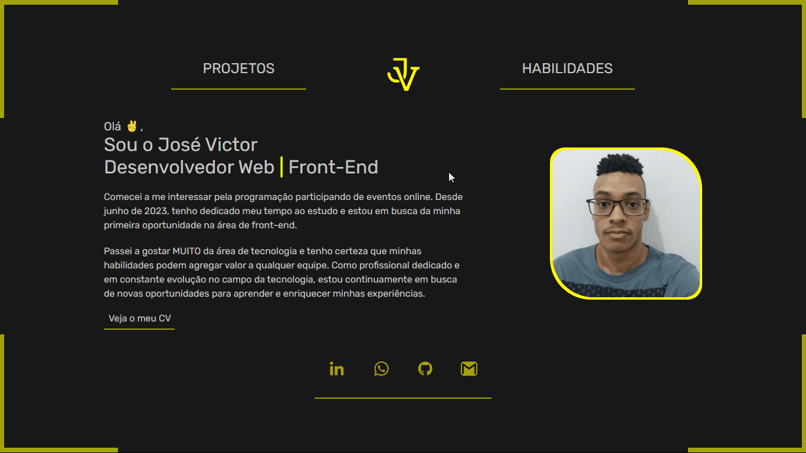

<h1 align="center">José Victor  Portifólio</h1>

###  Tópicos :

- **_<a href="#descrição-do-projeto">Descrição do projeto</a>_**

- **_<a href="#objetivo-do-projeto">Objetivo do projeto</a>_**

- **_<a href="#funcionalidades-e-demonstrações-da-aplicação">Funcionalidades e Demonstrações da Aplicação</a>_**

- **_<a href="#ferramentas-e-técnicas-utilizadas">Ferramentas e Técnicas utilizadas</a>_**

<h2 id="descrição-do-projeto"> Descrição do projeto :</h2>

- Este portfólio foi desenvolvido com o intuito em exibir meus projetos, e também destacar as habilidades e competências que possuo na área da programação. 

<h2 id="objetivo-do-projeto"> Objetivo do projeto :</h2>

- O propósito deste projeto é mantê-lo o mais simples possível, evitando excesso de seções ou textos longos para proporcionar uma experiência agradável e sem sobrecarga ao usuário que visitar o portfólio. 

<h2 id="funcionalidades-e-demonstrações-da-aplicação"> Funcionalidades e Demonstrações da Aplicação :</h2>

- **`Funcionalidade_1`**: Na página inicial, exibo uma breve descrição dos meus objetivos acompanhada de uma foto minha e um botão para visualizar o meu currículo.

- **`Funcionalidade_2`**: 
Na seção de Projetos, destaco alguns dos projetos mais relevantes que desenvolvi. Ao clicar em um deles, você encontrará uma breve descrição sobre o projeto, juntamente com 2 links: um direcionando para a página correspondente no GitHub e o outro para acessar o site: 

- **`Funcionalidade_3`**: Na seção de Habilidades, exibo as linguagens de programação, bibliotecas e frameworks que domino ou tenho conhecimento.

- **`Funcionalidade_4`**: Ao clicar no "Logo" o site volta para a página inicial: 

- **`Funcionalidade_5`**: Ao clicar em qualquer um dos botões o site muda de tema, ao todo são 14 temas :) .

- **`Funcionalidade_6`**: Em todas as páginas, estão disponíveis ícones das redes sociais que facilitam o contato direto comigo:

  

<h2 id="ferramentas-e-técnicas-utilizadas"> Ferramentas e Técnicas utilizadas :</h2>

- Optei por construir este projeto utilizando React para aproveitar o conceito de Single Page Applications (SPA), que consiste na criação de um site baseado em Aplicações de Página Única. Esta escolha permite uma navegação fluida e rápida para o usuário, sem a necessidade de carregar páginas diferentes a cada interação, proporcionando uma experiência mais dinâmica e ágil.

- Utilizei o React-Router-Dom para facilitar a navegação entre as diferentes páginas do projeto.

- Também foi utilizado o Context API para criar o Theme Toggler que serve para alternarmos os temas do site.

- A estilização completa do projeto foi realizada através do Styled-Components, proporcionando um design atraente, responsivo (mediante o uso de media query) e complementado por um fundo animado (aproveitando a propriedade animation).